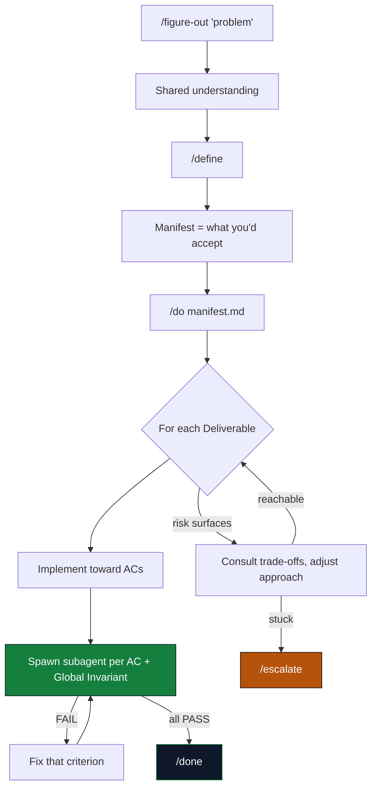

<p align="center">
  <picture>
    
  </picture>
</p>

# manifest-dev

#### Your agent builds the wrong thing, confidently.

<p align="center">
  
  
  
</p>

Not broken code — wrong code. It compiles. The tests pass. And it solves a problem you don't have, because the agent started typing before it understood what you meant.

**`/figure-out` is the pushback.** An adversarial thinking partner. It digs through your codebase on its own and presses on the question that decides the work. It refuses to touch code until you both know what "right" is, holds its position under pushback, and changes its mind when the evidence changes.

```bash
npx skills add doodledood/manifest-dev --skill figure-out
```

```
/figure-out why do half my background jobs silently stall?
```

A minute in, it has read your code and come back with the question you hadn't thought to ask. That first question is the fastest way to find out whether this tool is for you.

**Every skill here works standalone. Take what you want.** No framework to adopt, nothing else to install. If you never run another command from this repo, `/figure-out` still earns its keep.

## The loop was never the hard part

Everyone's writing loops now: the shift from prompting an agent by hand to designing the system that prompts it. But a loop pointed at a shallow understanding just ships the wrong thing faster. And the loop vouches for itself. It runs, declares victory on a confident summary. You find out in review.

The leverage lives upstream of the `while`: understand the problem before anything is built, define what "done" means, then verify it independently. That's the rest of manifest-dev: loop engineering, with a stop condition you can trust.

<table>
  <tr>
    <th align="left">How the loop fails</th>
    <th align="left">The skill that answers it</th>
  </tr>
  <tr>
    <td><strong>It skips understanding.</strong> A loop should be a faster path through a problem you already grasp; skipping that step turns it into a substitute for thinking.</td>
    <td><strong><code>/figure-out</code></strong> is the door you just walked through: adversarial understanding, before anything gets built.</td>
  </tr>
  <tr>
    <td><strong>It has no real stop condition.</strong> "Run until done" is worthless when "done" was never written down.</td>
    <td><strong><code>/define</code></strong> encodes what you'd accept: the acceptance criteria you'd reject in review but wouldn't think to specify up front.</td>
  </tr>
  <tr>
    <td><strong>It fakes "done."</strong> An agent reports success on broken code with total confidence.</td>
    <td><strong><code>/do</code></strong> makes it prove otherwise: one independent verifier per criterion, and it can't reach <code>/done</code> on a self-report.</td>
  </tr>
</table>

manifest-dev puts understanding first, adversarially, before `/define` writes anything down. Most spec-driven tools generate the spec straight from your description, so the spec runs only as deep as what you already said.

manifest-dev rides on top of whatever runs your loop, including your host's own `/loop` and `/goal`, and leaves scheduling jobs and managing worktrees to that runtime. It supplies the part those primitives leave to you: what to verify, and how to know you're actually done.

## Quick Start

The one-skill door is above. The full system installs as a plugin:

```bash
# Claude Code (primary)
/plugin marketplace add doodledood/manifest-dev
/plugin install manifest-dev@manifest-dev
```

For OpenCode, Codex CLI, and Pi, see [Multi-CLI Support](#multi-cli-support) below.

Then work through the three beats:

```bash
/figure-out <topic or problem>     # 1. Figure it out — understand before acting
/define <what you want to build>   # 2. Encode what you'd accept into a manifest
/do <manifest-path>                # 3. Execute and verify every criterion inline

/auto <what you want to build>     # Or run all three, chained, no approval gates
```

`/define` takes the understanding you reached and *encodes* it into a manifest, auto-invoking `/figure-out` first if you skipped ahead. `/do` implements toward the manifest and can't call it done until every criterion passes independent verification. `/auto` chains all three with no waiting.

For unattended runs of `/do` or `/auto` (the recommended way to run both), set your host's goal-setting or continuation capability to the completion contract those skills print; see the [manifest-dev plugin README](claude-plugins/manifest-dev/README.md#quick-start) for the full contract text and why it's shaped that way.

Babysit an existing PR through review without any manifest-dev setup: `/babysit-pr [pr-url]`. Details in the [manifest-dev-tools README](claude-plugins/manifest-dev-tools).

Pass `--canvas` to `/define` (desktop only) for a **Shared Understanding Canvas**: a live, browser-rendered side-channel where intent, flow, and scope render as you go, alongside the chat.

## How It Works



FAIL routes back to a fix; a real blocker (amber) routes to `/escalate`.

## What Changes

Your first pass lands closer to done, and the fix loop cleans up what's left on its own. Writing acceptance criteria also keeps you engaged with your own code. That matters more the more you lean on the agent, right when the codebase starts to feel like someone else wrote it.

> [!TIP]
> Resist the urge to jump in mid-`/do`. It won't nail everything first try; that's expected. You invested in understanding the problem, so let the loop run.

## Who This Is For

You've burned out on the weekly "game-changing AI coding tool" cycle and want something grounded that works. You're an experienced developer who cares more about output quality than raw speed, and you've learned the hard way that AI code needs guardrails more than cheerleading. If you count every cent per token, or want the fastest possible output regardless of what it costs you in review, this isn't your thing.

## Multi-CLI Support

The Claude Code plugins are the source of truth. The same components run in OpenCode, Codex CLI, and Pi through native per-CLI distributions under `dist/`, all verifying the same way: a general-purpose subagent or verifier execution per gate.

| CLI | Install | Details |
|-----|---------|---------|
| Claude Code | `/plugin install manifest-dev@manifest-dev` | Primary target |
| OpenCode | clone + one config line | [README](dist/opencode/README.md) |
| Codex CLI | `codex plugin marketplace add doodledood/manifest-dev` | [README](dist/codex/README.md) |
| Pi | `pi install git:github.com/doodledood/manifest-dev@main` | [README](dist/pi/README.md) |

Individual skills also install into 18+ agents (Cursor, Copilot, Cline, and more) via `npx skills add doodledood/manifest-dev --skill <name>`.

Each linked README covers that CLI's install, upgrade, and uninstall path. Architecture decisions behind the multi-CLI design are indexed in [`docs/adr/`](docs/adr/README.md).

## Available Plugins

| Plugin | Description |
|--------|--------------|
| [`manifest-dev`](claude-plugins/manifest-dev) | The core workflow (`/figure-out`, `/define`, `/do`, `/done`, `/escalate`, `/auto`, `/figure-out-team`) and the verification skills, including `review-code`'s per-dimension quality gates. |
| [`manifest-dev-tools`](claude-plugins/manifest-dev-tools) | Tools alongside the workflow: `/review-pr`, `/babysit-pr`, `/walk-pr` for PR collaboration, plus `/prompt-engineering`, `/handoff`, and `/teach-me`. |

Full plugin and skill catalogs live in [`claude-plugins/README.md`](claude-plugins/README.md) and each plugin's own README.

## Development

```bash
# Setup (first time)
./scripts/setup.sh
source .venv/bin/activate

# Lint, format, typecheck
ruff check --fix claude-plugins/ && black claude-plugins/ && mypy
```

After changing plugin components, run `/sync-tools` to regenerate the `dist/` distributions.

## Contributing

See [CONTRIBUTING.md](./CONTRIBUTING.md) for plugin development guidelines.

## License

MIT

---

*Built by developers who understand LLM limitations, and design around them.*

Follow along: [@aviramkofman](https://x.com/aviramkofman)
