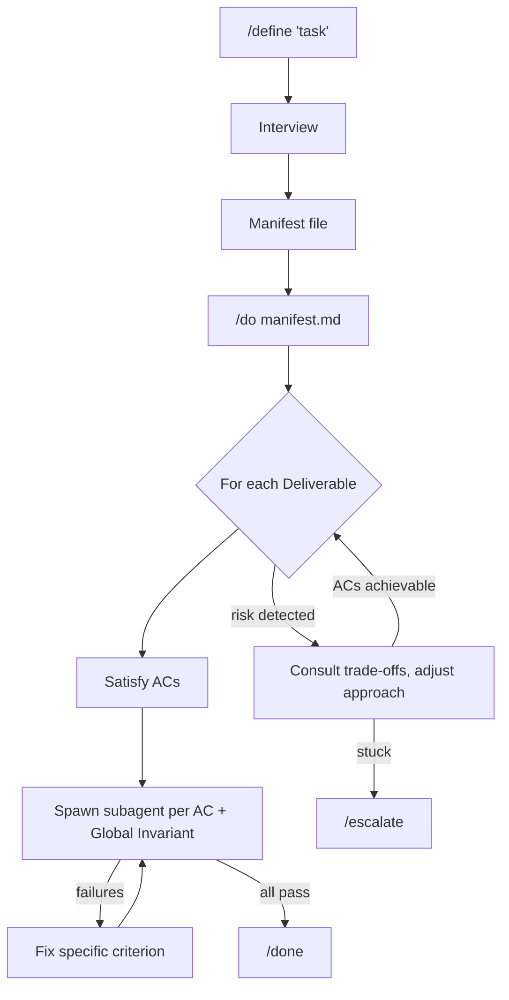

<p align="center">
  <picture>
    
  </picture>
</p>

# Manifest-Driven Development

Stop iterating with the model after implementation. Define what you'd accept, run two commands, ship it.

## Quick Start

```bash
# Claude Code (primary)
/plugin marketplace add doodledood/manifest-dev
/plugin install manifest-dev@manifest-dev-marketplace

# OpenCode — everything (skills, agents, commands, plugin)
curl -fsSL https://raw.githubusercontent.com/doodledood/manifest-dev/main/dist/opencode/install.sh | bash

# Codex CLI — everything (skills, TOML stubs, rules, config)
curl -fsSL https://raw.githubusercontent.com/doodledood/manifest-dev/main/dist/codex/install.sh | bash
```

The OpenCode installer writes to its global config directory by default (`~/.config/opencode/`) so the components load in every project. Use `--local` if you intentionally want only the current repo's `.opencode/`, and restart the CLI after updates because config-time files are loaded at startup.

Then use it:
```bash
# Define what to build, then execute
/define <what you want to build>
/do <manifest-path>

# Or go end-to-end autonomously:
/auto <what you want to build>

# Tend an existing PR through review without manifest-dev setup:
/auto --babysit <pr-url>          # synthesize lifecycle manifest, then run /do
/define --babysit <pr-url>        # just synthesize the manifest

# Figure something out (problem space foggy, or understanding IS the goal)
/figure-out <topic or problem>
```

`/define` interviews you and builds a manifest. `/do` executes it and verifies each criterion inline by spawning a subagent. `/auto` chains both — define autonomously, auto-approve, execute — in a single command. `/figure-out` is the thinking-partner skill — a truth-convergent peer that investigates before claiming, surfaces the load-bearing crux with each move, and resists premature synthesis. `/define` auto-invokes it when the problem space is foggy; you can also call it directly when figuring it out IS the goal.

Pass `--canvas` to `/define` (desktop only) to also generate a **Shared Understanding Canvas** — a live, browser-rendered visual side-channel for the chat interview. While you're answering questions, the canvas surfaces the intent, flow, and scope at a glance, so misalignment shows up early instead of after a feature ships. Diagrams (mermaid) and before/after panels render directly in your default browser; the canvas updates as the interview unfolds. The manifest stays as the formal encoding for /do.

If you use zsh and want easy upgrade commands for the non-Claude distributions, add this to `~/.zshrc`:

```zsh
alias upgrade-manifest-dev-codex='curl -fsSL https://raw.githubusercontent.com/doodledood/manifest-dev/main/dist/codex/install.sh | bash'
alias upgrade-manifest-dev-opencode='curl -fsSL https://raw.githubusercontent.com/doodledood/manifest-dev/main/dist/opencode/install.sh | bash'
alias upgrade-manifest-dev-all='upgrade-manifest-dev-codex && upgrade-manifest-dev-opencode'
```

Then run `source ~/.zshrc` once. Future updates are just `upgrade-manifest-dev-codex`, `upgrade-manifest-dev-opencode`, or `upgrade-manifest-dev-all` for both.

Uninstall uses the same entrypoints:

```bash
curl -fsSL https://raw.githubusercontent.com/doodledood/manifest-dev/main/dist/opencode/install.sh | bash -s -- uninstall
curl -fsSL https://raw.githubusercontent.com/doodledood/manifest-dev/main/dist/codex/install.sh | bash -s -- uninstall
```

## The Mindset Shift

Instead of telling the AI *how* to build something, you tell it what you'd accept.

Say you need a login page. The old way: "use React Hook Form, validate with Zod, show inline errors, disable the button while submitting." You've made every design decision upfront. The manifest way: "invalid credentials show an error without clearing the password field" and "the form can't be submitted twice." You define the bar. The AI picks how to clear it. Automated verification confirms it did.

## How It Works



`/define` interviews you to surface what you actually want. The stuff you'd reject in a PR but wouldn't think to specify upfront. Then `/do` implements toward those acceptance criteria, flexible on *how* but not on *what*.

`/do` verifies inline. For each Acceptance Criterion and Global Invariant, it spawns a subagent with the verify prompt, aggregates PASS / FAIL / BLOCKED across them, fixes what failed, and re-verifies. The loop continues until everything passes (then `/done`) or a blocker needs your attention (then `/escalate`).

## What Changes

Your first pass lands closer to done. Issues get caught by verification before you see them, and the fix loop handles cleanup without your involvement. Every acceptance criterion has been verified, and you know what was checked.

While one manifest executes, you can define the next. The define phase is where your judgment matters; the do-verify-fix phase runs on its own. Writing acceptance criteria also forces you to stay engaged with your own code, which matters when heavy AI usage starts making your codebase feel foreign.

Resist the urge to intervene during `/do`. It won't nail everything on the first pass. That's expected. You invested in define; let the loop run.

## Who This Is For

If you've burned out on the weekly "game-changing AI coding tool" cycle and just want something that works, this is for you. Experienced developers who care more about output quality than execution speed. People who've learned the hard way that AI-generated code needs guardrails more than cheerleading.

We build around how LLMs actually work, not how we wish they worked. That means investing upfront for better results, not optimizing for token cost or raw speed. If you're counting every cent per token or want the fastest possible output regardless of quality, this probably isn't your thing.

---

Everything below is reference. You don't need any of it to get started.

---

## Going Deeper

<details>
<summary><strong>The problem this solves</strong></summary>

You plan a feature with the agent. It implements. The code looks reasonable. Then you review it and half the things aren't how you'd want them: wrong error handling patterns, conventions ignored, edge cases skipped. You send it back. It fixes some things, breaks others. Two or three rounds later you're satisfied, but you've spent more time reviewing and iterating than you saved.

The models can code. But we're throwing them into deep water without defining what "done" actually means. So the review-iterate loop eats the productivity gains.

Manifest-dev front-loads that review energy into `/define`. You spell out acceptance criteria and invariants before implementation starts. The do phase becomes mechanical, and the output lands closer to what you'd accept as a reviewer.

</details>

<details>
<summary><strong>Why this works (LLM first principles)</strong></summary>

LLMs are goal-oriented pattern matchers trained through reinforcement learning, not general reasoners. Clear acceptance criteria play to that strength. Rigid step-by-step plans fall apart because neither you nor the model can predict every detail upfront. Acceptance criteria focus on outcomes and leave implementation open.

There's also the drift problem. Long sessions cause the model to lose track of earlier instructions. The manifest compensates with external state and verification that catches drift before it ships. And since LLMs can't express genuine uncertainty (they'll confidently produce broken code), the verify-fix loop doesn't rely on the AI knowing it failed. It relies on automated checks catching failures.

These are design constraints, and the workflow treats them that way.

</details>

<details>
<summary><strong>Process Guidance and Approach</strong></summary>

The manifest also supports Process Guidance and an initial Approach (architecture, execution order). These are exactly what they sound like: recommendations, not requirements. Hints to help the model make better decisions while it's still not AGI. The acceptance criteria are the contract; the guidance is optimization on top.

This is spec-driven development adapted for LLM execution. The manifest is a spec, but ephemeral: it drives one task, then the code is the source of truth. No spec maintenance. No drift.

</details>

### Best Practice: One Manifest Per PR/Branch (or PR Set), Feedback Through It

The manifest is the canonical source of truth for the PR/branch — or, in multi-repo cases, the entire PR set / branch set. Not for a single task. Feedback flows through it: when something's off mid-`/do` or after `/done` (a missed edge case, a reviewer comment, a bug you didn't anticipate), just send the feedback in your active session. The system routes it through Self-Amendment automatically: `/escalate` → `/define --amend` → `/do` resumes with the updated manifest. No manual session-switching for the common case. Pure questions about the manifest are answered inline; everything else amends.

**Multi-repo:** by default — and recommended — a single manifest covers the whole multi-repo changeset (Intent declares `Repos:`, deliverables tag `repo:`). `/do` navigates absolute paths from the map natively — no filter logic. PR-lifecycle work auto-templates one `github-pr-lifecycle` agent invocation per repo against the shared manifest. Splitting into independent per-repo manifests is also fine when the work is loosely coupled and you prefer to carry cross-PR coherence yourself. See `claude-plugins/manifest-dev/skills/define/references/MULTI_REPO.md` for the full convention.

After `/done`, the same default applies — the post-completion re-entry runs `/define --amend <manifest>` interactively (so you can shape the change), then `/do` re-executes. `/done` is unreachable until every Acceptance Criterion and Global Invariant verifies PASS again.

**Two-session pattern is still useful** when you want to draft the next manifest while one is executing — `/define` in one session, watch `/do` in another. But you no longer have to ferry feedback manually between them; the autonomous Self-Amendment flow handles that within a single session.

**Example**: You ship a login feature. A reviewer flags that error messages leak whether an email exists in the system.

1. In the same session, send: "Auth errors should return a generic message regardless of whether the account exists."
2. The system amends the manifest with a new AC, then re-enters `/do` to implement and verify it.
3. The new AC's subagent confirms the fix, then `/do` re-verifies everything before `/done` is reachable again. Future regressions are caught by the new criterion.

Every round trip through the manifest grows your verification surface. Bug fixes and late requirements become checked criteria, accumulated cumulatively per the manifest's full-PR-state guarantee.

The do session doesn't need to remember the define conversation. The manifest is external state. Run `/do` in a fresh session after `/define`, or at minimum `/compact` before starting.

## What /define Produces

The interview classifies your task (Feature, Bug, Refactor, Prompting, Writing, Document, Blog, Research) and loads task-specific guidance. It probes for your latent criteria — the standards you hold but wouldn't think to spell out — before writing the manifest.

<details>
<summary><strong>Example manifest</strong></summary>

````markdown
# Definition: User Authentication

## 1. Intent & Context
- **Goal:** Add password-based authentication to existing Express app
  with JWT sessions. Users can register, log in, and log out.
- **Mental Model:** Auth is a cross-cutting concern. Security invariants
  apply globally; endpoint behavior is per-deliverable.

## 2. Approach
- **Architecture:** Middleware-based auth with JWT stored in httpOnly cookies
- **Execution Order:** D1 (Model) → D2 (Endpoints) → D3 (Protected Routes)
- **Risk Areas:**
  - [R-1] Session fixation if tokens not rotated | Detect: security review
  - [R-2] Timing attacks on password comparison | Detect: constant-time check
- **Trade-offs:**
  - [T-1] Simplicity vs Security → Prefer security (use bcrypt, not md5)

## 3. Global Invariants (The Constitution)
- [INV-G1] Passwords never stored in plaintext
  ```yaml
  verify:
    prompt: "Run: grep -r 'password.*=' src/ | grep -v hash | grep -v test. PASS only if there are no matches."
  ```
- [INV-G2] All auth endpoints rate-limited (max 5 attempts/minute)
  ```yaml
  verify:
    prompt: "Inspect src/auth/ and confirm rate limiting (max 5 attempts/minute) is wired to /login and /register endpoints. Report PASS or FAIL with evidence."
  ```
- [INV-G3] JWT secrets from environment, never hardcoded
  ```yaml
  verify:
    prompt: "Confirm src/auth/ reads JWT secrets from process.env and contains no hardcoded JWT strings."
  ```

## 4. Process Guidance (Non-Verifiable)
- [PG-1] Follow existing error handling patterns in the codebase
- [PG-2] Use established logging conventions

## 5. Known Assumptions
- [ASM-1] Express.js already configured | Default: true | Impact if wrong: Add setup step
- [ASM-2] PostgreSQL available | Default: true | Impact if wrong: Adjust migration

## 6. Deliverables (The Work)

### Deliverable 1: User Model & Migration
**Acceptance Criteria:**
- [AC-1.1] User model has id, email, hashedPassword, createdAt
  ```yaml
  verify:
    prompt: "Confirm the User model definition includes id, email, hashedPassword, and createdAt fields."
  ```
- [AC-1.2] Email has unique constraint
- [AC-1.3] Migration creates users table with indexes

### Deliverable 2: Auth Endpoints
**Acceptance Criteria:**
- [AC-2.1] POST /register creates user, returns 201
- [AC-2.2] POST /login validates credentials, returns JWT
- [AC-2.3] Invalid credentials return 401, not 500
  ```yaml
  verify:
    agent: code-bugs-reviewer
    prompt: "Check auth routes return 401 for auth failures, not 500."
  ```
````

</details>

## The Manifest Schema

| Section | Purpose | ID Scheme |
|---------|---------|-----------|
| **Intent & Context** | Goal and mental model | -- |
| **Approach** | Architecture, execution order, risks, trade-offs | `R-{N}`, `T-{N}` |
| **Global Invariants** | Task-level rules (task fails if violated) | `INV-G{N}` |
| **Process Guidance** | Non-verifiable recommendations for how to work | `PG-{N}` |
| **Known Assumptions** | Low-impact items with defaults | `ASM-{N}` |
| **Deliverables** | Ordered work items with acceptance criteria | `AC-{D}.{N}` |

Approach section is added for complex tasks with dependencies, risks, or architectural decisions.

## Verify Blocks

Every criterion has a `verify` block — four fields, all optional except `prompt`:

| Field | Required | Purpose |
|-------|----------|---------|
| `prompt` | yes | Verbatim instruction to the verifier subagent. Whatever it needs to do — run a bash command, inspect files, query an API, fetch docs — goes here. |
| `agent` | no | Subagent type to spawn (e.g., `code-bugs-reviewer`, `criteria-checker`). Defaults to a general-purpose subagent. |
| `model` | no | Model override (e.g., `claude-haiku-4-5-20251001` for speed). Defaults to inherit from the invoking session. |
| `phase` | no | Integer (default `1`). Lower phases run first; later phases (e2e, deploy-dependent) only after earlier pass. Avoids wasting slow cycles when cheaper checks fail. |

```yaml
# Cheap bash check via general-purpose subagent
verify:
  prompt: "Run: npm run test -- --coverage. PASS only if exit 0 and coverage report shows ≥80%."

# Specialized reviewer
verify:
  agent: code-maintainability-reviewer
  prompt: "Review for DRY violations and coupling issues."

# Slow staging probe in a later phase
verify:
  prompt: "curl -s https://staging.example.com/health and confirm it returns 200 with status: ok."
  phase: 2

# Manual check
verify:
  prompt: "MANUAL: ask the operator to confirm the login flow works in staging. Report PASS only after explicit human confirmation in the channel."
  phase: 3
```

The subagent returns one of three states: **PASS** (criterion holds), **FAIL** (criterion violated; includes evidence — a per-gate directive `/do` executes literally for specialized verifiers like `github-pr-lifecycle`, or a prose fix hint read with judgment for generic verifiers), or **BLOCKED** (criterion can't be evaluated yet — pending deploy, human approval, etc.; `/do` routes BLOCKED via `/escalate`).

## Multi-CLI Support

The Claude Code plugins are the source of truth. Per-CLI distributions under `dist/` provide native packages for other AI coding CLIs. Each has a one-command remote installer — run again to update, or pass `uninstall` to remove only manifest-dev-managed files. Installers include core `manifest-dev` components with `-manifest-dev` names and `manifest-dev-tools` skills with `-manifest-dev-tools` names.

| CLI | Install | Skills | Agents | Hooks | Details |
|-----|---------|--------|--------|-------|---------|
| Claude Code | `/plugin install` | Full | Full | Full | Primary target |
| OpenCode | `curl .../opencode/install.sh \| bash` | Full | Full (converted) | Partial (adapted plugin) | [README](dist/opencode/README.md) |
| Codex CLI | `curl .../codex/install.sh \| bash` | Full | TOML stubs | Not available | [README](dist/codex/README.md) |

**Keeping distributions in sync**: After changing plugin components, run `/sync-tools` in Claude Code to regenerate `dist/`. The sync skill reads reference files with per-CLI conversion rules, regenerates component namespace metadata, and produces the full distribution for each target.

## Available Plugins

| Plugin | Description |
|--------|-------------|
| `manifest-dev` | Core manifest workflows: `/define`, `/do`, `/done`, `/escalate`, `/auto`, `/figure-out`, `/figure-out-team`, review agents, workflow hooks. `/do` verifies inline — spawns a subagent per Acceptance Criterion and Global Invariant. The manifest is the canonical source of truth for the PR/branch — feedback during `/do` or after `/done` defaults to amending it. PR-lifecycle work composes the `github-pr-lifecycle` agent through PR_LIFECYCLE.md; `/define --babysit <pr-url>` synthesizes a lifecycle manifest from an existing PR. |
| `manifest-dev-tools` | Utilities that complement manifest workflows. `/adr` synthesizes Architecture Decision Records from session transcripts via multi-agent extraction pipeline. `/handoff` produces a cross-boundary context payload (tool switch, fresh session, multi-agent transfer). `/prompt-engineering` and `/walk-pr` are stand-alone collaboration tools. |

## Plugin Architecture

### Core Skills

| Skill | Type | Description |
|-------|------|-------------|
| `/define` | User-invoked | Interviews you, classifies task type, probes for latent criteria, writes the manifest. Auto-invokes `/figure-out` when the problem space is foggy. Defaults to amending a prior in-scope manifest (in-session, conversation-referenced, or branch-archived in `.manifest/`) so one change set keeps one constitution. On a fresh /define against a non-empty branch, seeds from the existing diff. |
| `/do` | User-invoked | Executes against manifest and verifies inline — spawns a subagent per Acceptance Criterion and Global Invariant using the verify prompt, aggregates PASS / FAIL / BLOCKED, fixes failures, re-verifies. Calls `/done` when everything passes or `/escalate` when blocked. Any user feedback during execution defaults to a Self-Amendment cycle (pure questions answered inline). |
| `/auto` | User-invoked | End-to-end autonomous: `/define` → auto-approve → `/do`. Supports `--platform` and `--babysit <pr-url>` for tending an existing PR through to mergeable. |
| `/done` | Internal | Plain-prose completion summary called by `/do` after every criterion verifies PASS. |
| `/escalate` | Internal | Structured blocker: criterion, attempts and why each failed, possible resolutions, what's needed from the user. Routes via `/do`. |
| `/figure-out` | User-invoked | Primary thinking-partner skill. Peer working a problem with the user: investigates before claiming, delivers each next-move with its load-bearing crux, walks decision trees for design-shaped tasks, holds positions under social pressure. Pass `--with-docs` to opt into bootstrap, inline glossary captures, and ADR offers. |
| `/figure-out-team` | User-invoked | `/figure-out`'s discipline applied to a multi-party async Slack conversation. Involved orchestrator (brings evidence, viewpoints, synthesis); polls the thread via `/loop`, reads via the `slack-poller` subagent; owner-by-Slack-handle overrules disagreement. Pass `--with-docs` (read-only) to load CONTEXT.md as background context for the deliberation. |

### Review Agents

Built-in agents `/do` spawns to verify criteria. Name an agent in the verify block's `agent:` field, or omit it to get a general-purpose subagent.

| Agent | Focus |
|-------|-------|
| `criteria-checker` | General-purpose criterion verifier — runs whatever bash, file reads, or external tools the prompt specifies |
| `change-intent-reviewer` | Adversarial intent analysis: reconstructs change intent, finds behavioral divergences across code, prompts, and config |
| `contracts-reviewer` | Bidirectional API/interface contract verification with source-of-truth evidence from docs, schemas, generated clients, and codebase definitions |
| `code-bugs-reviewer` | Mechanical code defects: race conditions, data loss, edge cases, resource leaks, dangerous defaults |
| `operational-readiness-reviewer` | Runtime and deployment readiness: environment wiring, migrations, retries, rollback, scale, CI, and observability risks |
| `code-maintainability-reviewer` | DRY violations, coupling, cohesion, dead code, consistency |
| `code-design-reviewer` | Design fitness: reinvented wheels, wrong responsibility ownership, code vs configuration boundary, under-engineering, interface foresight, PR coherence |
| `code-simplicity-reviewer` | Over-engineering, premature optimization, cognitive complexity |
| `code-testability-reviewer` | Excessive mocking requirements, logic buried in IO, hidden dependencies |
| `test-quality-reviewer` | Test quality: coverage gaps plus independent-oracle checks for tautology, mirror-impl, mock-SUT, trivial asserts, and hidden scenarios |
| `prose-value-reviewer` | Prose value in code comments and repo doc files — flags narrating-the-obvious comments, generic puffery, AI rhetorical patterns, sycophantic fragments. Comments must be load-bearing-WHY |
| `type-safety-reviewer` | Typed-language safety: type holes, invalid states representable, narrowing issues |
| `docs-reviewer` | Documentation accuracy against code changes |
| `context-file-adherence-reviewer` | Compliance with context file (CLAUDE.md/AGENTS.md) project rules |
| `github-pr-lifecycle` | PR-lifecycle inspector — checks CI, review threads, description sync, mergeability; returns PASS/FAIL with per-gate directives (`bash sleep …; reinvoke`, `retrigger …`, `reply …`, `escalate`, …) the caller executes literally. Owns its wait-cadence policy (per-gate durations and cycle caps; steering customizable). Composed automatically when `--platform github` resolves during `/define`. |
| `slack-poller` | Tails a Slack thread for the `/figure-out-team` loop, returning the verbatim deltas the agent reasons over. |

Each reviewer returns structured output with severity levels (Critical, High, Medium, Low) and specific fix guidance.

### Workflow Enforcement Hooks

Hooks enforce workflow integrity. The AI can't skip steps:

| Hook | Event | Purpose |
|------|-------|---------|
| `stop_do_hook` | Stop command | Blocks premature stopping. Can't stop without verification passing or proper escalation. |
| `post_compact_hook` | Session compaction | Restores /do workflow context after compaction. Reminds to re-read the manifest. |

### Task-Specific Guidance

`/define` loads guidance based on task classification:

| Task Type | Guidance | Quality Gates |
|-----------|----------|---------------|
| **Feature** | `tasks/FEATURE.md` + `CODING.md` | Bug detection, operational readiness, type safety, maintainability, simplicity, test quality, testability, prose value, CLAUDE.md adherence |
| **Bug** | `tasks/BUG.md` + `CODING.md` | Bug fix verification, regression prevention, root cause analysis |
| **Refactor** | `tasks/REFACTOR.md` + `CODING.md` | Behavior preservation, maintainability, simplicity |
| **Prompting** | `tasks/PROMPTING.md` | Prompt quality criteria |
| **Writing** | `tasks/WRITING.md` | Prose quality, AI tells, vocabulary, anti-patterns, craft fundamentals (base for Blog, Document) |
| **Document** | `tasks/DOCUMENT.md` + `WRITING.md` | Structure completeness, consistency |
| **Blog** | `tasks/BLOG.md` + `WRITING.md` | Engagement, SEO |
| **Research** | `tasks/research/RESEARCH.md` + source files | Source-agnostic research methodology. Source-specific guidance in `tasks/research/sources/` |

## Development

```bash
# Setup (first time)
./scripts/setup.sh
source .venv/bin/activate

# Lint, format, typecheck
ruff check --fix claude-plugins/ && black claude-plugins/ && mypy

# Test hooks (run after ANY hook changes)
pytest tests/hooks/ -v

# Test plugin locally
/plugin marketplace add /path/to/manifest-dev
/plugin install manifest-dev@manifest-dev-marketplace
```

## Contributing

See [CONTRIBUTING.md](./CONTRIBUTING.md) for plugin development guidelines.

## License

MIT

---

*Built by developers who understand LLM limitations, and design around them.*

Follow along: [@aviramkofman](https://x.com/aviramkofman)
