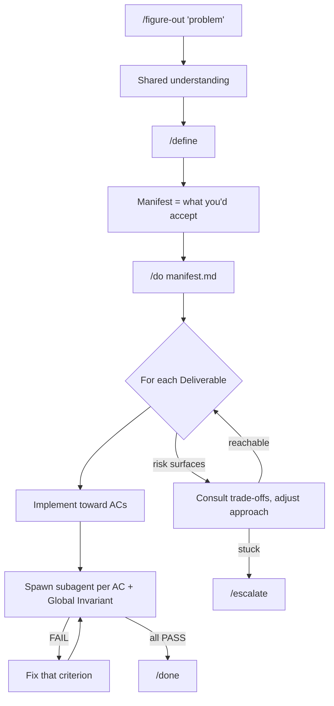

<p align="center">
  <picture>
    
  </picture>
</p>

# Manifest-Driven Development

Hand off a real task. Trust what comes back.

That's the bar. The workflow earns it by front-loading the part that decides quality. First you understand the problem — with a thinking partner that pushes back instead of nodding along. Then you write down what you'd accept. Then the agent builds toward that bar and checks its own work against every line of it, before you ever open the diff.

Three skills, one idea: figure it out, write down what "done" means, let it build and verify itself.

## Quick Start

```bash
# Claude Code (primary)
/plugin marketplace add doodledood/manifest-dev
/plugin install manifest-dev@manifest-dev-marketplace

# OpenCode — clone the repo, then add the plugin to ~/.config/opencode/opencode.json
git clone https://github.com/doodledood/manifest-dev.git ~/.manifest-dev/repo
#   "plugin": ["~/.manifest-dev/repo/dist/opencode/plugin"]

# Codex CLI — native plugins from the repo marketplace (add the marketplace, then install both plugins)
codex plugin marketplace add doodledood/manifest-dev
codex plugin add manifest-dev@manifest-dev
codex plugin add manifest-dev-tools@manifest-dev

# Pi — repo-root package, shared skills plus Harness-level commands
pi install git:github.com/doodledood/manifest-dev@main
```

Pi exposes shared skills as `/skill:<name>` commands and registers `/do`, `/auto`, and `/babysit-pr` through its runtime extension. Harness-level Do keeps the executor simple: implement Deliverables, run useful local checks, repair runtime-injected failed AC/INV reports, then stop. The runtime starts clean verification attempts, records a clean verification orchestration session, fans out manifest-dev-owned Pi JSON subprocess verifiers — one per Acceptance Criterion and Global Invariant — injects failed-gate evidence back into the executor as follow-up work, and records done only after every gate passes. The Pi verifier fanout uses its own cap (`--manifest-verifier-max-concurrent`, default 10) and does not require a separate verifier fanout package.

Then work through the three beats:

```bash
# 1. Figure it out — when the problem space is foggy, or understanding IS the goal
/figure-out <topic or problem>

# 2. Encode what you'd accept into a manifest
/define <what you want to build>

# 3. Execute and verify every criterion inline.
#    Wrap in /goal so the run continues across turns on its own — the recommended way to run /do.
/goal /do <manifest-path>
/do <manifest-path>          # foreground variant, runs in the current turn only

# Or run the whole thing autonomously, no approval gates:
/goal /auto <what you want to build>
```

`/figure-out` is the heart of it — a peer that investigates before it claims, walks the decision tree for design-shaped problems, and holds its position under pushback. `/define` doesn't interview you; it takes the understanding you reached and *encodes* it into a manifest (auto-invoking `/figure-out` first if you skipped ahead and the understanding isn't there yet). `/do` implements toward the manifest and spawns a subagent per criterion to verify inline. `/auto` chains all three with no waiting.

Run `/do` and `/auto` through `/goal` — it's the recommended way to run both. `/goal` is the host CLI's turn-continuation wrapper: it keeps the run alive across turns, so verification and fixes carry all the way through without you babysitting. Bare `/do` is fine for a quick single-turn run you're watching.

Babysit an existing PR through review without any manifest-dev setup:

```bash
/babysit-pr [pr-url]          # infer or synthesize grounding, then run the lifecycle
/babysit-pr --ci [pr-url]     # CI one-shot: advance state, push trusted fixes, exit on waiting
/babysit-pr --log [pr-url]    # keep a persisted journal so a long warm tend stays coherent
/auto --babysit <pr-url>      # core define→do chain for a supplied PR URL
/define --babysit <pr-url>    # just synthesize the manifest
```

`/babysit-pr` is the author-side companion to `/review-pr`: review applies quality pressure through comments and thread advancement; babysit uses the strongest available grounding (manifest, PR description, commits/diff, then comments) to get the PR green and mergeable without pressing merge. In trusted same-repo CI it may auto-fix, commit, and push; on untrusted or unwritable heads it reports/escalates instead.

In Pi, install the repo-root package, then use `/do <manifest-path>` for execution, `/auto <task>` for the autonomous chain, and `/babysit-pr <pr-url>` for PR lifecycle tending.

Pass `--canvas` to `/define` (desktop only) for a **Shared Understanding Canvas**: a live, browser-rendered side-channel that runs alongside the chat. Intent, flow, and scope render as you go (mermaid diagrams, before/after panels), so misalignment shows up while you can still cheaply fix it. The manifest stays the formal encoding for `/do`.

<details>
<summary><strong>Upgrade aliases and uninstall</strong></summary>

For zsh, add upgrade shortcuts for the non-Claude distributions:

```zsh
alias upgrade-manifest-dev-codex='codex plugin marketplace upgrade'
alias upgrade-manifest-dev-opencode='if [ -d ~/.manifest-dev/repo/.git ]; then git -C ~/.manifest-dev/repo pull --ff-only; else git clone https://github.com/doodledood/manifest-dev.git ~/.manifest-dev/repo; fi'
alias upgrade-manifest-dev-pi='pi update --extensions'
alias upgrade-manifest-dev-all='upgrade-manifest-dev-codex && upgrade-manifest-dev-opencode && upgrade-manifest-dev-pi'
```

Run `source ~/.zshrc` once. After that, updates are just `upgrade-manifest-dev-codex`, `upgrade-manifest-dev-opencode`, `upgrade-manifest-dev-pi`, or `upgrade-manifest-dev-all`.

OpenCode loads manifest-dev through a plugin pointed at the repo clone — updating is just pulling the clone, then restarting the CLI (config-time files load at startup). Requires OpenCode ≥ v1.2.16; see [dist/opencode/README.md](dist/opencode/README.md) for details and for migrating off the retired installer.

Pi owns its package lifecycle. Use `pi install -l git:github.com/doodledood/manifest-dev@main` for project-local manifest-dev installs, `pi update` or `pi update --extensions` to update installed packages, and `pi remove git:github.com/doodledood/manifest-dev` to remove the repo package.

Uninstall uses the same entrypoints:

```bash
# OpenCode: remove the plugin line from ~/.config/opencode/opencode.json, then
rm -rf ~/.manifest-dev/repo
codex plugin remove manifest-dev@manifest-dev && codex plugin remove manifest-dev-tools@manifest-dev && codex plugin marketplace remove manifest-dev
pi remove git:github.com/doodledood/manifest-dev
```

</details>

## Why This Is Different

Most spec-driven tools take your description and generate a spec, a plan, and then code. The spec is a transcript of what you already said. If your understanding was thin, the spec is thin, and you find out three hundred lines later.

This flips the order. Understanding comes first and it's adversarial — `/figure-out` presses the load-bearing question, investigates the code instead of asking you, and refuses to leap to the implied edit. Only once the problem is actually understood does `/define` encode it, and what it encodes is an *acceptance contract*: the things you'd reject in review but wouldn't think to write down. Not "use Zod, disable the button while submitting." Instead: "invalid credentials show an error without clearing the password field," "the form can't be submitted twice." You set the bar. The agent picks how to clear it.

Then `/do` proves it cleared the bar. Every Acceptance Criterion and Global Invariant gets its own verifier execution context before completion (a verifier subagent on subagent-capable hosts, a Pi JSON subprocess in Pi). Failures get fixed and re-checked without you in the loop. The manifest is ephemeral — it drives one PR, then the code is the source of truth. No spec to maintain, nothing to drift.

## How It Works



`/figure-out` surfaces what you want, including the stuff you'd reject in a PR but wouldn't think to specify. `/define` turns that into criteria — flexible on *how*, fixed on *what*. `/do` implements toward those criteria, then verifies inline: one subagent per criterion with its verify prompt, aggregating PASS / FAIL / BLOCKED, fixing what failed, re-verifying. The loop runs until everything passes (`/done`) or a blocker needs you (`/escalate`).

## What Changes

Your first pass lands closer to done, because verification catches the issues before you see them and the fix loop cleans up on its own. Every criterion has been checked, and you know which ones. While one manifest executes, you can define the next — the judgment lives in the understanding phase; the build-verify-fix phase runs itself.

Writing acceptance criteria also keeps you engaged with your own code. That matters more the more you lean on the agent, right when the codebase starts to feel like someone else wrote it.

Resist the urge to jump in mid-`/do`. It won't nail everything first try. That's expected — you invested in understanding the problem; let the loop run.

## Who This Is For

You've burned out on the weekly "game-changing AI coding tool" cycle and want something grounded that works. You're an experienced developer who cares more about output quality than raw speed, and you've learned the hard way that AI code needs guardrails more than cheerleading.

The workflow is built around how LLMs actually behave, not how we wish they did. That means spending tokens and time upfront for a better result. If you count every cent per token, or you want the fastest possible output regardless of what it costs you in review, this isn't your thing.

---

Everything below is reference. You don't need any of it to get started.

---

## Going Deeper

<details>
<summary><strong>The problem this solves</strong></summary>

You plan a feature with the agent. It implements. The code looks reasonable. Then you review it and half the things aren't how you'd want them: wrong error handling, conventions ignored, edge cases skipped. You send it back. It fixes some, breaks others. Three rounds later you're satisfied, but you've spent more time reviewing than you saved.

The models can code. We just throw them in without defining what "done" means, so the review-iterate loop eats the gains. Manifest-dev front-loads that review energy: you understand the problem and spell out the criteria before implementation starts. The do phase becomes mechanical, and the output lands closer to what you'd accept as a reviewer.

</details>

<details>
<summary><strong>Why this works (LLM first principles)</strong></summary>

LLMs are goal-oriented pattern matchers trained through reinforcement learning, not general reasoners. Clear acceptance criteria play to that strength. Rigid step-by-step plans fall apart, because neither you nor the model can predict every detail upfront; criteria focus on outcomes and leave the implementation open.

There's also drift. Long sessions cause the model to lose track of earlier instructions. The manifest compensates with external state and verification that catches drift before it ships. And since LLMs can't express genuine uncertainty — they'll produce broken code with total confidence — the verify-fix loop doesn't rely on the model knowing it failed. It relies on automated checks catching the failure.

These are design constraints, and the workflow treats them as such.

</details>

<details>
<summary><strong>Process Guidance and Approach</strong></summary>

The manifest also carries Process Guidance and an initial Approach (architecture, execution order). These are what they sound like: recommendations, not requirements. Hints that help the model decide well while it's still not AGI. The acceptance criteria are the contract; the guidance is optimization on top.

This is spec-driven development adapted for LLM execution. The manifest is a spec, but ephemeral — it drives one task, then the code is the source of truth.

</details>

### One manifest per PR, feedback through it

The manifest is the canonical source of truth for the PR or branch (in multi-repo work, the whole PR set), not for a single task. Feedback flows through it. When something's off mid-`/do` or after `/done` — a missed edge case, a reviewer comment, a bug you didn't see coming — say it in your active session. The system routes it through Self-Amendment automatically: `/escalate` → `/define` re-invoked on the manifest path to amend → `/do` resumes with the updated manifest. Pure questions about the manifest get answered inline; everything else amends. `/done` stays unreachable until every criterion verifies PASS again, so each round trip grows your verification surface — bug fixes and late requirements become permanent checked criteria.

**Multi-repo:** by default a single manifest covers the whole changeset (Intent declares `Repos:`, deliverables tag `repo:`). `/do` navigates absolute paths from the map natively. PR-lifecycle work templates one `check-pr` skill run per repo against the shared manifest. Splitting into per-repo manifests is fine when the work is loosely coupled. See [`MULTI_REPO.md`](claude-plugins/manifest-dev/skills/define/references/MULTI_REPO.md).

The do session doesn't need to remember the define conversation — the manifest is external state. Run `/goal /do` in a fresh session, or `/compact` before starting.

## What /define Produces

`/define` classifies the task (Feature, Bug, Refactor, Prompting, Writing, Document, Blog, Research) and loads task-specific guidance, then encodes the understanding into a manifest.

<details>
<summary><strong>Example manifest</strong></summary>

````markdown
# Definition: User Authentication

## 1. Intent & Context
- **Goal:** Add password-based auth to an Express app with JWT sessions.
- **Mental Model:** Auth is cross-cutting. Security invariants apply
  globally; endpoint behavior is per-deliverable.

## 2. Approach
- **Architecture:** Middleware-based auth, JWT in httpOnly cookies
- **Execution Order:** D1 (Model) → D2 (Endpoints) → D3 (Protected Routes)
- **Trade-offs:**
  - [T-1] Simplicity vs Security → Prefer security (bcrypt, not md5)

## 3. Global Invariants (The Constitution)
- [INV-G1] Passwords never stored in plaintext
  ```yaml
  verify:
    prompt: "Run: grep -r 'password.*=' src/ | grep -v hash | grep -v test. PASS only if there are no matches."
  ```

## 4. Process Guidance (Non-Verifiable)
- [PG-1] Follow existing error handling patterns in the codebase

## 6. Deliverables (The Work)

### Deliverable 1: Auth Endpoints
**Acceptance Criteria:**
- [AC-1.1] POST /login validates credentials, returns JWT
- [AC-1.2] Invalid credentials return 401, not 500
  ```yaml
  verify:
    prompt: "Activate the manifest-dev:review-code skill with dimension=code-bugs and review the auth routes. PASS only if no LOW-or-higher findings (e.g. auth failures returning 500 instead of 401)."
  ```
````

</details>

### The manifest schema

| Section | Purpose | ID Scheme |
|---------|---------|-----------|
| **Intent & Context** | Goal and mental model | -- |
| **Approach** | Architecture, execution order, risks, trade-offs | `R-{N}`, `T-{N}` |
| **Global Invariants** | Task-level rules (task fails if violated) | `INV-G{N}` |
| **Process Guidance** | Non-verifiable recommendations for how to work | `PG-{N}` |
| **Known Assumptions** | Low-impact items with defaults | `ASM-{N}` |
| **Deliverables** | Ordered work items with acceptance criteria | `AC-{D}.{N}` |

Approach is added for complex tasks with dependencies, risks, or architectural decisions. Amendments overwrite in place with stable IDs — modify `INV-G1` and it stays `INV-G1`, remove one and it's gone with no renumbering. Git carries the history; there's no amendment log inside the manifest.

### Verify blocks

Every criterion carries a `verify` block. One required field, three optional:

| Field | Required | Purpose |
|-------|----------|---------|
| `prompt` | yes | Verbatim instruction to the general-purpose verifier execution context — run a bash command, inspect files, query an API, fetch docs, or activate a skill (e.g. the `review-code` skill for one dimension), whatever it takes. |
| `model` | no | Model override (e.g. `claude-haiku-4-5-20251001` for speed). Defaults to the invoking session's model. |
| `phase` | no | Integer, default `1`. Lower phases run first; slow checks (e2e, deploy-dependent) wait in a later phase so cheap checks fail fast. |

```yaml
# Cheap bash check via the general-purpose verifier execution context
verify:
  prompt: "Run: npm run test -- --coverage. PASS only if exit 0 and coverage shows ≥80%."

# Quality dimension via the review-code skill
verify:
  prompt: "Activate the manifest-dev:review-code skill with dimension=code-maintainability and review the change. PASS only if no MEDIUM-or-higher findings (DRY violations, coupling)."

# Slow staging probe, gated to a later phase
verify:
  prompt: "curl -s https://staging.example.com/health and confirm 200 with status: ok."
  phase: 2
```

A verifier returns one of three states. **PASS** — the criterion holds. **FAIL** — it's violated, with evidence: a per-gate directive `/do` runs literally (when the prompt activates a specialized skill like `check-pr`), or a prose fix hint read with judgment (for plain prompts). **BLOCKED** — it can't be evaluated yet (pending deploy, human approval), and `/do` routes it through `/escalate`.

## Multi-CLI Support

The Claude Code plugins are the source of truth. Per-CLI distributions under `dist/` package the same components for other AI coding CLIs, each through its native extension unit: a Codex plugin marketplace, an OpenCode plugin (a repo clone plus one config line), and a Pi package installed from the repository root (Pi owns Harness-level verification with Pi JSON subprocess fanout). No distribution installs into shared Agent Skills directories, and every target keeps original component names — no install-time suffixing anywhere.

manifest-dev ships no agents of its own, so distributions carry skills only. Claude-style and OpenCode/Codex verification use a general-purpose subagent whose prompt can activate a skill; Pi runs the same per-gate verifier prompt in a manifest-dev-owned JSON subprocess.

| CLI | Install | Skills | Verification | Details |
|-----|---------|--------|--------------|---------|
| Claude Code | `/plugin install` | Full | General-purpose subagent per criterion | Primary target |
| OpenCode | clone + `"plugin": ["…/dist/opencode/plugin"]` | Full | General-purpose subagent per criterion | [README](dist/opencode/README.md) |
| Codex CLI | `codex plugin marketplace add doodledood/manifest-dev` | Full | General-purpose subagent per criterion | [README](dist/codex/README.md) |
| Pi | `pi install git:github.com/doodledood/manifest-dev@main` | Shared subset + runtime commands | JSON subprocess verifier fanout + outcome gate | [README](dist/pi/README.md) |

After changing plugin components, run `/sync-tools` in Claude Code to regenerate `dist/`. It reads per-target conversion rules and rebuilds each target's distribution (regenerating Pi's ownership metadata along the way). The Pi target additionally carries a capability model for package install/update, skill loading, extension commands, resource discovery, prompt assets, sessions/forks, and the current Harness-level Do JSON verifier fanout plus outcome gate.

Architecture decisions, including the accepted Codex plugin-native migration plan, are indexed in [`docs/adr/`](docs/adr/README.md).

## Available Plugins

| Plugin | Description |
|--------|-------------|
| [`manifest-dev`](claude-plugins/manifest-dev) | The core workflow: `/figure-out`, `/define`, `/do`, `/done`, `/escalate`, `/auto`, `/figure-out-team`, and the verification skills. `/do` verifies inline — a general-purpose subagent per Acceptance Criterion and Global Invariant. The recommended way to run it is `/goal /do <manifest-path>`, which keeps the run alive across turns. The manifest is the canonical source of truth for the PR/branch; feedback during `/do` or after `/done` defaults to amending it. PR-lifecycle work activates the `check-pr` skill; `/define --babysit <pr-url>` synthesizes a lifecycle manifest from an existing PR. |
| [`manifest-dev-tools`](claude-plugins/manifest-dev-tools) | Tools alongside the workflow. `/prompt-engineering` for building and reviewing prompts. `/walk-pr` (collaborative review), `/review-pr` (autonomous review that posts human-voiced comments), and `/babysit-pr` (author-side PR lifecycle babysitting that runs manifest machinery) cover PR collaboration. `/adr` synthesizes Architecture Decision Records from a session. `/handoff` packages context for a fresh agent or a side-session. `/teach-me` turns a body of work — the session, a PR, an ADR, or any topic — into an incremental teaching loop with mastery checks. |

## Plugin Architecture

### Core skills

| Skill | Type | Description |
|-------|------|-------------|
| `/figure-out` | User-invoked | The thinking partner, and the conceptual core. A truth-convergent peer: investigates before claiming, voices every claim as verified/inferred/assumed, walks the decision tree for design-shaped tasks, keeps a belief register for evidence-heavy investigations, holds positions under pushback, and ships its read with an Evidence Ledger (load-bearing claims + provenance), confidence, and what would overturn it — running an independent fresh-context re-derivation before confident reads nobody will audit. On domain-shaped topics (code change, diagnosis, research) it loads its own probe task files to surface easy-to-miss angles (verification among them), pressed by judgment, never as a checklist. `/define` auto-invokes it when understanding is missing; call it directly when figuring it out IS the goal. `--with-docs` opts into bootstrap, glossary captures, and ADR offers; `--log [path]` keeps a narrative investigation log; `--autonomous` lets it self-answer (used by `/auto`); `--team` runs the deliberation in a Slack channel or thread (used by `/figure-out-team`). |
| `/define` | User-invoked | Encodes the conversation's shared understanding into a manifest. Not an interview — it makes the manifest-specific calls (invariant vs guidance, AC scope, phase ordering, trade-offs to lock) and auto-invokes `/figure-out` first if the understanding isn't there. Pass an existing manifest path to amend it in place. Emits both `/do` and `/goal /do` handoffs. Supports `--babysit <pr-url>` and `--canvas`. |
| `/do` | User-invoked | Executes against the manifest and verifies inline — a subagent per Acceptance Criterion and Global Invariant using the verify prompt, aggregating PASS / FAIL / BLOCKED, fixing failures, re-verifying. Calls `/done` when everything passes, routes to `/escalate` when blocked. Caller overlays can narrow retry cadence, e.g. CI one-shot runs report wait-only states instead of sleeping. Recommended invocation is `/goal /do <manifest-path>` — `/goal` keeps the run alive across turns; bare `/do` runs a single foreground turn. Mid-execution feedback defaults to a Self-Amendment cycle. |
| `/auto` | User-invoked | End-to-end autonomous: `/figure-out` → `/define` → `/do`, chained with no approval gates. Run it as `/goal /auto` so it carries across turns (recommended). `--babysit <pr-url>` tends an existing PR toward mergeable (platform auto-detected from the PR URL host). |
| `/figure-out-team` | User-invoked | Thin discovery wrapper that runs `/figure-out --team`: the full figure-out discipline applied to a multi-party async Slack conversation. An involved orchestrator that brings evidence, names trade-offs, and surfaces disagreement; polls the thread via `/loop`, reads via the `poll-slack` subagent. Owner-by-Slack-handle overrules. `--with-docs` loads CONTEXT.md as background; `--log [path]` keeps a local log without posting it to Slack. |
| `/done` | Internal | Plain-prose completion summary, called by `/do` after every criterion verifies PASS. |
| `/escalate` | Internal | Structured blocker: the criterion, what was tried and why each attempt failed, possible resolutions, what's needed from you. Routed by `/do`. |

### Verification skills

manifest-dev ships **no agents of its own**. `/do` always verifies criteria with a general-purpose subagent driven by the verify block's `prompt`, which can run bash, inspect files, query an API, or activate one of the verification skills below.

**Functional skills:**

| Skill | Focus |
|-------|-------|
| `check-pr` | PR-lifecycle inspector — CI, review threads, description sync, mergeability; returns PASS/FAIL with per-gate directives or prose findings. Activated automatically when the repo's `origin` remote points at github.com. |
| `poll-slack` | Tails a Slack thread for the `/figure-out-team` loop, returning verbatim deltas the agent reasons over |
| `review-prompt` *(manifest-dev-tools)* | Reviews LLM prompts against the prompt-engineering skill's gap-calibration principles |

**Code-review skill** — quality review is the `review-code` skill, **one dimension per invocation** (a general-purpose subagent activates it from the verify prompt; the skill loads exactly that dimension's reference).

| Dimension | Role | Focus |
|-----------|------|-------|
| `change-intent` | defect (no LOW+) | Adversarial intent analysis: reconstructs intent, finds behavioral divergences |
| `code-bugs` | defect (no LOW+) | Mechanical defects: races, data loss, edge cases, resource leaks, dangerous defaults |
| `contracts` | defect (no LOW+) | Bidirectional API/interface contract checks against docs, schemas, codebase definitions |
| `type-safety` | defect (no LOW+) | Typed-language safety: type holes, representable invalid states, narrowing |
| `operational-readiness` | advisory (no MEDIUM+) | Runtime/deploy readiness: env wiring, migrations, retries, rollback, scale, CI, observability |
| `code-design` | advisory (no MEDIUM+) | Design fitness: reinvented wheels, wrong responsibility, under-engineering, PR coherence |
| `code-maintainability` | advisory (no MEDIUM+) | DRY violations, coupling, cohesion, dead code, consistency |
| `code-simplicity` | advisory (no MEDIUM+) | Over-engineering, premature optimization, cognitive complexity |
| `code-testability` | advisory (no MEDIUM+) | Excessive mocking, logic buried in IO, hidden dependencies |
| `test-quality` | advisory (no MEDIUM+) | Coverage gaps plus independent-oracle checks for tautology, mirror-impl, mock-SUT |
| `docs` | advisory (no MEDIUM+) | Documentation accuracy against code changes |
| `prose-value` | advisory (no MEDIUM+) | Comment/doc value — narrating-the-obvious, puffery, AI rhetorical patterns |
| `context-file-adherence` | advisory (no MEDIUM+) | Compliance with CLAUDE.md / AGENTS.md project rules |

### Task-specific guidance

Guidance comes in two parallel, decoupled sets, each loaded by task type by its own skill. `/figure-out` loads its own probe task files (`skills/figure-out/tasks/` — `CODING.md`, `FEATURE.md`, `BUG.md`, `REFACTOR.md`, plus the non-code-gated `DIAGNOSIS.md` for symptom/incident investigations and `RESEARCH.md` for external-evidence questions), matched on the topic's shape and carrying blind-spot probes and forced trade-offs (verification among them) surfaced as awareness, not a checklist. `/define` loads the encoder set below, which carries quality gates and Defaults:

| Task Type | Guidance | Quality Gates |
|-----------|----------|---------------|
| **Feature** | `tasks/FEATURE.md` + `CODING.md` | Bugs, operational readiness, type safety, maintainability, simplicity, test quality, testability, prose value, CLAUDE.md adherence |
| **Bug** | `tasks/BUG.md` + `CODING.md` | Bug-fix verification, regression prevention, root cause |
| **Refactor** | `tasks/REFACTOR.md` + `CODING.md` | Behavior preservation, maintainability, simplicity |
| **Prompting** | `tasks/PROMPTING.md` | Prompt quality |
| **Writing** | `tasks/WRITING.md` | Prose quality, AI tells, vocabulary, craft (base for Blog, Document) |
| **Document** | `tasks/DOCUMENT.md` + `WRITING.md` | Structure completeness, consistency |
| **Blog** | `tasks/BLOG.md` + `WRITING.md` | Engagement, SEO |
| **Research** | `tasks/research/RESEARCH.md` + source files | Source-agnostic methodology; source-specific guidance in `tasks/research/sources/` |

Code tasks also compose `tasks/PR_LIFECYCLE.md` when the repo's `origin` is on github.com.

## Development

```bash
# Setup (first time)
./scripts/setup.sh
source .venv/bin/activate

# Lint, format, typecheck
ruff check --fix claude-plugins/ && black claude-plugins/ && mypy

# Test plugin locally
/plugin marketplace add /path/to/manifest-dev
/plugin install manifest-dev@manifest-dev-marketplace
```

## Contributing

See [CONTRIBUTING.md](./CONTRIBUTING.md) for plugin development guidelines.

## License

MIT

---

*Built by developers who understand LLM limitations, and design around them.*

Follow along: [@aviramkofman](https://x.com/aviramkofman)
