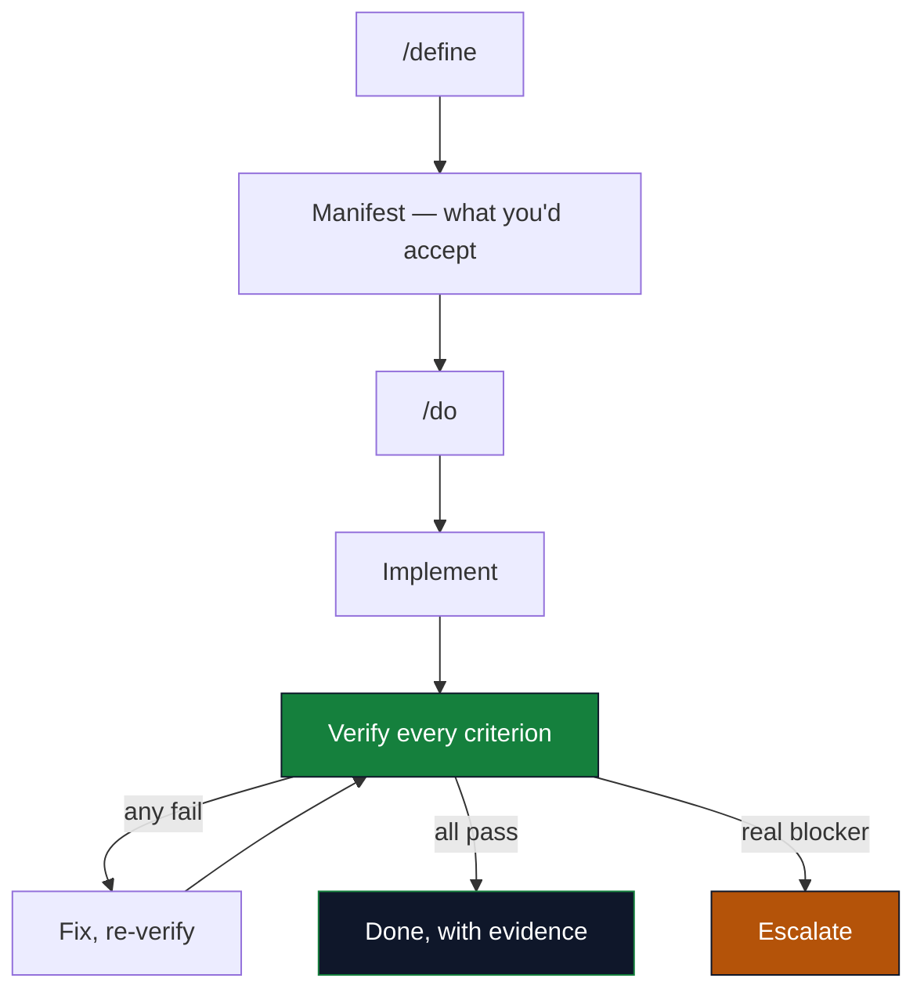

<p align="center">
  <picture>
    
  </picture>
</p>

# manifest-dev

Skills for agentic coding CLIs. They keep three things in your project instead of in your head: what it's becoming, what's worth doing next, and what done means here. The agent reads them, works against them, and checks the result before reporting it finished.

Agents can write almost anything. What they can't do is tell you whether it was worth writing. So a project drifts: every session re-derives the direction from scratch, and speed produces more work than anyone can evaluate. Writing those three things down where the agent reads them is the whole idea.

Start with one command, in any repository:

```bash
/figure-out why do half my background jobs silently stall?
```

It reads your code first, then comes back with the question that decides the work. Nothing gets built until you both know what "right" means here.

## The three things, and where they live

Each one makes the next decidable. You can't judge what's worth doing without knowing what the project is for, and you can't judge a diff without knowing what done means:

| What it answers | Where it lives | Lifetime |
|-----------------|----------------|----------|
| What is this project becoming? | A North Star, in the repo | Stands until you change it |
| What's worth doing next? | A Ticket, in your tracker or in files | As long as that piece of work |
| What does done mean here? | A Manifest, written per run | Resets every run |

`/init-context` sets up the first of these, along with a glossary and decision-record conventions, seeding them from the project's own history where there is any. `/ticket-up` writes the second. `/define` writes the third, and `/do` executes against it.

## Install

Claude Code is the primary target:

```bash
/plugin marketplace add doodledood/manifest-dev
/plugin install manifest-dev@manifest-dev
```

Every skill also works on its own. If you only want the one from the top of this page:

```bash
npx skills add doodledood/manifest-dev --skill figure-out
```

## The workflow

Three skills, run in order, though each is useful alone:

```bash
/figure-out <topic>          # understand the problem before touching anything
/define <what you want>      # write down what you'd accept
/do <manifest-path>          # build it, then verify every criterion
```

`/define` turns understanding into a Manifest: the deliverables, the criteria each one has to meet, and the rules that hold across all of them. It calls `/figure-out` first if the conversation hasn't reached understanding yet.

`/do` implements against that Manifest and can't report completion until every criterion has evidence behind it. Verification runs independently of the work by default, so "it's done" is a finding rather than a claim.


```mermaid
flowchart TD
    A["/define"] --> B["Manifest — what you'd accept"]
    B --> C["/do"]
    C --> D["Implement"]
    D --> E["Verify every criterion"]
    E -->|any fail| F["Fix, re-verify"]
    F --> E
    E -->|all pass| G["Done, with evidence"]
    E -->|real blocker| H["Escalate"]
    classDef gate fill:#15803D,stroke:#0F172A,color:#FFFFFF;
    classDef done fill:#0F172A,stroke:#15803D,color:#FFFFFF;
    classDef stop fill:#B45309,stroke:#0F172A,color:#FFFFFF;
    class E gate;
    class G done;
    class H stop;
```

`/auto` chains all three without stopping for approval between them. `/just-figure-out`, `/just-define`, `/just-do` and `/just-auto` are leaner variants of the same beats — same contracts, minimal process.

For an unattended run, point your host's goal-setting or continuation capability at the completion contract `/do` prints. Where a host offers neither, `/do` prints the contract for you to use with whatever keeps the run alive.

## What it costs

More tokens and more work up front than prompting directly. What you get back is a first pass that lands closer to done and a result you can check rather than take on trust. Writing acceptance criteria also keeps you engaged with your own code, which matters more the more of it the agent writes.

Resist jumping in mid-`/do`. It won't get everything first try — that's what the verify loop is for.

## What's in it

Three plugins ship from this repository:

| Plugin | What it covers |
|--------|----------------|
| [`manifest-dev`](claude-plugins/manifest-dev) | The workflow itself, project setup, ticket authoring and execution, design build-and-review, and the review skills the criteria call on |
| [`manifest-dev-tools`](claude-plugins/manifest-dev-tools) | Pull-request collaboration, prompt work, teaching, explaining, and handoff between sessions |
| [`manifest-dev-meta`](claude-plugins/manifest-dev-meta) | Maintainer-facing tooling for developing manifest-dev's own plugins. |

Each plugin's README lists what it ships.

## Other CLIs

The Claude Code plugins are the source; `dist/` carries generated distributions for other hosts.

| CLI | Install |
|-----|---------|
| Claude Code | `/plugin install manifest-dev@manifest-dev` |
| Codex CLI | `codex plugin marketplace add doodledood/manifest-dev` — [details](dist/codex/README.md) |
| Pi | `pi install git:github.com/doodledood/manifest-dev@main` — [details](dist/pi/README.md) |
| OpenCode | clone, then add one path to your config — [details](dist/opencode/README.md) |

Individual skills install into many other agents through `npx skills add doodledood/manifest-dev --skill <name>`.

Decisions behind the multi-CLI design are indexed in [`docs/adr/`](docs/adr/README.md).

## Development

```bash
./scripts/setup.sh
source .venv/bin/activate

ruff check --fix claude-plugins/ tests/ && black claude-plugins/ tests/ && mypy && python3 -m pytest tests/
```

Run `/sync-tools` after changing plugin components to regenerate `dist/`.

## Contributing

This is built for its author's own projects and shared as it's used. See [CONTRIBUTING.md](./CONTRIBUTING.md) for how the plugins are put together.

## License

MIT
